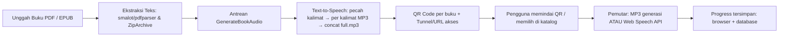

<div align="center">


# Read-Assist

**Platform buku audio digital yang dapat diakses untuk penyandang tunanetra — Text-to-Speech otomatis, QR Code, dan pemutar yang ramah aksesibilitas.**

</div>

<p align="center">
  <a href="https://readassist.web-id.id/">🌐 Buka Aplikasi</a>
  &nbsp;·&nbsp;
  <a href="https://github.com/Ayries18/Read-Assist">📦 Repository</a>
</p>

<div align="center">


</div>

---

## Daftar Isi

- [Tentang Proyek](#tentang-proyek)
- [Tujuan](#tujuan)
- [Cara Kerja](#cara-kerja)
- [Fitur Utama](#fitur-utama)
- [Aksesibilitas](#aksesibilitas)
- [Teknologi](#teknologi)
- [Demo](#demo)
- [Persyaratan](#persyaratan)
- [Instalasi](#instalasi)
- [Konfigurasi](#konfigurasi)
- [Menjalankan Aplikasi](#menjalankan-aplikasi)
- [Ekstraksi PDF & EPUB](#ekstraksi-pdf--epub)
- [Text-to-Speech](#text-to-speech)
- [Pengujian](#pengujian)
- [Struktur Proyek](#struktur-proyek)
- [Deployment](#deployment)
- [Keamanan](#keamanan)
- [Pengembang](#pengembang)

---

## Tentang Proyek

**Read-Assist** adalah platform berbasis web (Laravel) yang menghubungkan buku digital dengan audio untuk membantu penyandang **tunanetra** mengakses materi literasi secara mandiri.

Setiap buku yang diunggah diproses secara otomatis menjadi audio melalui **Text-to-Speech (TTS)**. Buku tersebut mendapatkan **QR Code** unik; pengguna cukup memindai label QR — yang dapat ditempel pada buku fisik — menggunakan kamera smartphone untuk langsung membuka halaman pemutar audio tanpa perlu navigasi yang rumit.

Aplikasi ini dapat diakses melalui browser (desktop maupun mobile). Pada lingkungan development, QR Code secara otomatis memilih URL yang tepat — SSH tunnel publik (`localhost.run`), IP LAN, atau `APP_URL` — sehingga perangkat di jaringan yang sama maupun jaringan luar dapat menjangkau pemutar.

---

## Tujuan

Menyediakan akses informatif yang mandiri bagi penyandang tunanetra dengan mengubah buku digital (PDF/EPUB) menjadi audio yang dapat diputar kapan saja, serta menghubungkan buku fisik ke audio melalui QR Code — tanpa memerlukan aplikasi terpisah atau perangkat khusus.

---

## Cara Kerja



1. **Unggah buku** — Admin atau pengguna mengunggah dokumen **PDF** atau **EPUB** (maks. 50 MB) melalui form unggah buku.
2. **Ekstraksi teks** — Konten diekstrak otomatis: PDF diparsing dengan `smalot/pdfparser`, EPUB dibaca dengan `ZipArchive` (membaca file `.html`/`.xhtml` internal).
3. **Generasi audio latar belakang** — Job `GenerateBookAudio` diperintahkan ke antrean (`QUEUE_CONNECTION=database`). Teks dipecah menjadi kalimat, lalu setiap kalimat dikirim ke TTS. Progress persentase (`audio_progress`) dan status (`audio_status`) diperbarui real-time dan ditampilkan di halaman katalog/detail.
4. **Perakitan audio** — Potongan MP3 kalimat digabungkan menjadi satu file `full.mp3` dengan `concatAudio()` (penggabungan binari MP3).
5. **QR Code & routing** — Setiap buku memiliki token unik (`qr_token`, UUID). QR mengarah ke `/scan/book/{qr_token}`. URL target dipilih secara dinamis: SSH tunnel (`localhost.run`), Ngrok, IP LAN, atau domain publik.
6. **Akses pengguna** — Pemindaian QR atau kunjungan dari katalog membuka halaman pemutar.
7. **Pemutaran** — Jika audio MP3 telah selesai dibuat, pemutar `audio` HTML5 dipakai; sebaliknya aplikasi memakai **Web Speech API** untuk membacakan teks **kalimat demi kalimat** (fallback tanpa MP3).
8. **Progress** — Posisi kalimat tersimpan di `localStorage` dan disinkronkan ke server (`ListeningProgress`) untuk pengguna yang login, sehingga pembacaan dapat dilanjutkan dari kalimat terakhir.

---

## Fitur Utama

| Area | Fitur | Keterangan |
| :--- | :--- | :--- |
| **Buku** | Katalog buku audio | Pencarian, filter kategori, dan pengurutan (terbaru/terlama/judul). |
| **Unggah** | Dukungan PDF & EPUB | Upload dokumen maks. 50 MB dengan validasi `mimes:pdf,epub`. |
| **Ekstraksi** | Ekstraksi teks otomatis | PDF via `smalot/pdfparser`; EPUB via `ZipArchive`; fallback ke deskripsi bila teks kosong. |
| **TTS** | Generasi audio latar belakang | Queue `GenerateBookAudio` memecah kalimat lalu menyintesis MP3 per kalimat; progres & status live. |
| **Audio** | Audio utuh & streaming | MP3 utuh (`full.mp3`) tersedia (`/audio-stream/{book}`) beserta tautan unduh. |
| **QR Code** | QR Code unik per buku | Token UUID, gambar SVG (`storage/app/public/qr/`), bisa diregenerasi dengan `qr:regenerate`. |
| **Player** | Pemutar MP3 generasi | Kontrol `audio` HTML5 dengan lompat ±10 detik. |
| **Player** | Pemutar TTS berbasis Web Speech API | Pembacaan kalimat demi kalimat menggunakan `SpeechSynthesisUtterance` (bahasa `id-ID`). |
| **Player** | Kontrol suara (voice command) | Perintah lisan via `SpeechRecognition` (Bahasa Indonesia): play, pause, next, prev, stop, speed, settings. |
| **Player** | Pintasan keyboard | `Space` play/pause, `ArrowLeft`/`ArrowRight` pindah kalimat, `Escape` berhenti/menutup modal. |
| **Player** | Navigasi sentuh (swipe) | Geser kiri/kanan untuk pindah kalimat pada perangkat layar sentuh. |
| **Progress** | Sinkronisasi progress | Posisi kalimat disimpan di `localStorage` dan database (`ListeningProgress`) bagi pengguna login. |
| **Pengaturan** | Kecepatan, ukuran font, kontras | Opsi kecepatan suara (0.75x–2.0x), ukuran font, dan mode kontras — tersimpan otomatis di perangkat. |
| **Aksesibilitas** | Widget aksesibilitas global | Kontras tinggi, perbesar teks (A/A+/A++), dan suara pendamping yang dinyalakan dari navbar / tombol mengambang. |
| **Auth** | Dua peran: admin & user | Custom session auth (`auth_id`, `auth_role`, `auth_name`), dashboard terpisah dengan statistik masing-masing. |
| **Auth** | Reset password via email | Email `PasswordResetMail` dengan token kedaluwarsa 60 menit + fallback link debug saat SMTP tidak aktif. |
| **Analisis teks** | Asisten Baca (Read-Assist) | Alat analisis teks: jumlah kata, jumlah kalimat, ringkasan, dan 5 kata kunci — diproses secara lokal (PHP). |
| **Tampilan** | Tema terang/gelap/ikuti sistem | Toggle tema global yang disimpan di perangkat. |
| **PWA** | Manifest & service worker | `manifest.json` + `sw.js` untuk pengalaman aplikasi instalable. |
| **Keamanan** | Validasi unggah & ownership | Hanya admin/pemilik buku dapat mengubah/hapus; guest QR dibatasi hanya untuk bukunya. |

---

## Aksesibilitas

Read-Assist dibangun mengikuti panduan **WCAG 2.2** dan mengutamakan usability bagi pengguna pembaca layar (TalkBack, VoiceOver) dan navigasi keyboard:

- **ARIA** — Landmark semantik (`nav`, `main`, `footer`), `aria-label` deskriptif pada semua kontrol interaktif, `aria-live="polite"` + `aria-atomic` untuk teks yang sedang dibacakan dan pesan status, serta `role="status"` untuk notifikasi.
- **Kontras tinggi** — Mode kontras tinggi dengan latar hitam (`#000000`) dan aksen kuning (`#FBBF24`), disertai opsi ukuran teks besar.
- **Navigasi keyboard** — Pintasan `Space` (play/pause), `ArrowLeft`/`ArrowRight` (kalimat sebelumnya/berikutnya), dan `Escape` (hentikan / tutup modal & dropdown).
- **Fokus & modal** — Fokus berpindah ke elemen pertama saat modal dibuka dan kembali ke tombol pemicu saat ditutup; focus trap pada drawer mobile; Escape menutup seluruh panel/dropdown.
- **Skip link** — Tautan "Lewati ke konten utama" di awal halaman untuk pengguna keyboard.
- **Tanpa autoplay** — Audio hanya diputar saat pengguna menekan tombol play secara sadar, menghindari bentrokan dengan pembaca layar.
- **Suara pendamping** — Membacakan label/sebutan elemen saat di-hover/fokus (dapat dimatikan; disarankan nonaktif bagi pengguna TalkBack).
- **Kontrol suara** — Perintah lisan Bahasa Indonesia untuk mengoperasikan pemutar tanpa menyentuh layar.

> Catatan: repository saat ini **belum menyertakan tooling pengujian aksesibilitas otomatis** (seperti axe-core atau Playwright). Penerapan di atas diverifikasi secara manual berdasarkan panduan WCAG; tingkat kepatuhan penuh terhadap standar belum disertifikasi secara formal.

---

## Teknologi

| Aspek | Teknologi |
| :--- | :--- |
| **Framework** | Laravel 13 (`laravel/framework: ^13.8`) |
| **Bahasa** | PHP 8.3+ |
| **Template** | Blade |
| **Frontend Scripting** | JavaScript (vanilla) — Web Speech API (`SpeechSynthesis`, `SpeechRecognition`) |
| **Styling** | Tailwind CSS v4 (`tailwindcss: ^4.0.0`) + DaisyUI 5 (`daisyui: ^5.5.20`) |
| **Asset Bundler** | Vite 8 (`vite: ^8.0.0`, `laravel-vite-plugin: ^3.1`) |
| **Database** | SQLite (default `database/database.sqlite`); in-memory `:memory:` untuk pengujian |
| **HTTP Client** | Guzzle (`guzzlehttp/guzzle: ^7.10`) |
| **Ekstraksi PDF** | `smalot/pdfparser: ^2.12` |
| **Ekstraksi EPUB** | PHP `ZipArchive` (bawaan) |
| **Text-to-Speech** | Google Translate TTS endpoint (non-resmi) `translate.google.com/translate_tts` (`client=tw-ob`) |
| **QR Code** | `simplesoftwareio/simple-qrcode: ^4.2` |
| **Antrean** | Laravel Queue (driver `database`) |
| **Tunneling** | SSH reverse tunnel (`localhost.run`) dengan deteksi fallback Ngrok & IP LAN |
| **Testing** | PHPUnit `^12.5` via `php artisan test` (+ `composer test`) |
| **Code Style** | Laravel Pint `^1.27` (PSR-12) |
| **Accessibility testing** | Tidak ada tooling otomatis di repository (lihat catatan pada bagian Aksesibilitas) |

---

## Demo

Coba aplikasi secara langsung:

<p align="center">
  <a href="https://readassist.web-id.id/"><strong>→ Buka Read-Assist</strong></a>
</p>

Akun yang tersedia dari seeder (`php artisan migrate:fresh --seed`):

| Role | Email | Password | Keterangan |
| :--- | :--- | :--- | :--- |
| **Admin** | `admin@example.com` | `password` | Akses halaman dashboard admin & kelola semua buku. |
| **User** | `muwarisin@gmail.com` | `Aris1234` | Akses dashboard user, unggah buku sendiri, dan progres mendengarkan. |

---

## Persyaratan

- **PHP 8.3+** dan [Composer](https://getcomposer.org/)
- **Node.js** dan **npm** (untuk Vite / asset)
- Ekstensi PHP: `zip` (untuk EPUB/`ZipArchive`), `gd` opsional (pada Docker telah diinstal), `pdo_sqlite` untuk SQLite
- **SSH client** — hanya dibutuhkan bila memakai mode tunnel publik (`php artisan tunnel:start`)
- Tidak memerlukan `poppler-utils` — ekstraksi PDF dilakukan sepenuhnya di dalam PHP (dipasang di Dockerfile sebagai utilitas pelengkap, bukan kebergantungan kode)

---

## Instalasi

```bash
# 1. Clone repository
git clone https://github.com/Ayries18/Read-Assist.git
cd Read-Assist

# 2. Install dependensi PHP & JavaScript
composer install
npm install

# 3. Buat file environment
cp .env.example .env
php artisan key:generate

# 4. Buat database SQLite & jalankan migrasi + seeder
touch database/database.sqlite
php artisan migrate:fresh --seed
```

Jika ingin menggunakan skrip setup otomatis:

```bash
composer run setup
```

---

## Konfigurasi

Variabel utama pada file `.env` (lihat `.env.example` untuk daftar lengkap):

| Variabel | Deskripsi | Contoh |
| :--- | :--- | :--- |
| `APP_NAME` | Nama aplikasi | `Read-Assist` |
| `APP_ENV` | Lingkungan aplikasi | `local` / `production` |
| `APP_DEBUG` | Mode debug (matikan di production) | `true` / `false` |
| `APP_URL` | URL aplikasi (dipakai base QR & email) | `http://127.0.0.1:8000` |
| `DB_CONNECTION` | Driver database | `sqlite` (atau `mysql` di production) |
| `SESSION_DRIVER` | Driver sesi | `database` |
| `QUEUE_CONNECTION` | Driver antrean | `database` |
| `CACHE_STORE` | Driver cache | `database` |
| `MAIL_MAILER` | Mailer | `log` (local) / `smtp` (production) |
| `TTS_PROVIDER` | Provider TTS | `google` |
| `TTS_TIMEOUT` | Timeout (detik) permintaan TTS | `120` |
| `GOOGLE_TTS_URL` | Endpoint Google Translate TTS | <https://translate.google.com/translate_tts> |

> Jangan isi kredensial rahasia (seperti `NINEROUTER_KEY`) di repository — gunakan environment variabel di server. `NineRouterService` saat ini tersedia sebagai layanan (OpenRouter-compatible) namun belum dipanggil dari alur aplikasi.

---

## Menjalankan Aplikasi

### Satu perintah (semua layanan)

Menjalankan server web, queue worker (TTS), Vite hot-reload, dan SSH tunnel secara paralel:

```bash
composer run dev
```

Buka [http://127.0.0.1:8000](http://127.0.0.1:8000).

### Manual per layanan

```bash
php artisan serve                  # Web server (bind 0.0.0.0 — dapat diakses dari LAN)
npm run dev                        # Vite hot-reload (development)
php artisan queue:listen --tries=1 --timeout=0   # Queue worker untuk generasi audio TTS
php artisan tunnel:start           # SSH tunnel publik untuk akses QR dari jaringan luar
```

Catatan: **queue worker wajib berjalan** agar generasi audio latar belakang berfungsi. `php artisan serve` dimodifikasi untuk bind ke `0.0.0.0`, membuka browser otomatis, dan mendukung akses dari perangkat lain di jaringan LAN (yang dipakai pemutar QR).

---

## Ekstraksi PDF & EPUB

- **PDF** — Diproses di dalam PHP oleh `smalot/pdfparser` (`Parser::parseFile()` → `getText()`). Hasil dibersihkan: normalisasi encoding UTF-8, `html_entity_decode`, dan perapian spasi/baris.
- **EPUB** — File `.epub` dibuka sebagai ZIP (`ZipArchive`); seluruh berkas `.html`/`.xhtml` internal dibaca, tag-strip (`strip_tags`), dan digabung menjadi teks. Terdapat batasan keamanan 5.000.000 karakter.
- Jika teks hasil ekstraksi kosong, sistem mengembalikan pesan kesalahan unggah; saat generasi audio, fallback memakai deskripsi buku.

---

## Text-to-Speech

Implementasi ada di `app/Services/TTSEngine.php` dan dijalankan oleh job `app/Jobs/GenerateBookAudio.php`:

- **Provider** — Google Translate TTS endpoint (non-resmi): `https://translate.google.com/translate_tts` dengan parameter `client=tw-ob`, `tl=id` (bahasa Indonesia). Dikonfigurasi lewat `config/tts.php` (`TTS_PROVIDER=google`).
- **Pemecahan teks** — `splitSentences()` memecah paragraf menjadi kalimat (batas `.`, `!`, `?`); kalimat panjang dipecah lagi menjadi segmen maks. **150 karakter** (`ide_chars`). Pembukaan "Membaca buku: {judul}." ditambahkan otomatis.
- **Batas permintaan** — Maks **180 karakter** per permintaan (`max_chars`); teks yang lebih panjang dipecah per kata menjadi beberapa potongan MP3 lalu digabungkan.
- **Timeout & retry** — Timeout default **120 detik** (`TTS_TIMEOUT`), hingga 3 percobaan per kalimat dengan *exponential backoff* (0,5s → 1s) bila gagal.
- **Penggabungan audio** — `concatAudio()` menggabungkan raw MP3 tiap kalimat menjadi satu file `full.mp3` (dengan `copy()` bila hanya satu kalimat).
- **Rate limit** — `usleep(150000)` (150 ms) antar kalimat untuk meredam request beruntun ke endpoint eksternal.
- Tidak ada integrasi AI/LLM (OpenAI, Gemini, dll.) pada alur TTS.

---

## Pengujian

Konfigurasi PHPUnit (`phpunit.xml`) memakai SQLite in-memory (`:memory:`), queue sinkron, sesi array, dan mail array saat testing.

```bash
# Menjalankan seluruh suite (29 test)
php artisan test

# Alternatif via composer
composer test

# Menjalankan file/satu test tertentu
php artisan test tests/Feature/AudioBukuTest.php
php artisan test --filter=test_user_can_login

# Pengecekan format kode (PSR-12)
vendor/bin/pint --test

# Terapkan perbaikan format otomatis
vendor/bin/pint
```

---

## Struktur Proyek

```text
Read-Assist/
├── app/
│   ├── Console/Commands/        # Artisan: serve (LAN-aware), tunnel:start/stop, qr:regenerate
│   ├── Http/
│   │   ├── Controllers/         # AudioBuku, Auth, ReadAssist, QRCode
│   │   └── Middleware/          # EnsureAuthenticated, RestrictQrGuest, SetContentLength
│   ├── Jobs/                    # GenerateBookAudio (queue TTS)
│   ├── Mail/                    # PasswordResetMail
│   ├── Models/                  # AudioBuku, User, Admin, ListeningProgress, PasswordResetToken
│   ├── Providers/
│   └── Services/                # TTSEngine, TunnelService, NineRouterService
├── bootstrap/                   # Bootstrapping & middleware aliases
├── config/                      # Config aplikasi (termasuk config/tts.php)
├── database/
│   ├── factories/               # UserFactory, AudioBukuFactory
│   ├── migrations/
│   └── seeders/                 # DatabaseSeeder (akun admin & user)
├── public/                      # logo, manifest PWA, service worker, favicon, build/ (Vite)
├── resources/
│   ├── css/                     # Styling Tailwind & tema (kontras tinggi, dll.)
│   ├── js/                      # Entry Vite
│   └── views/                   # Template Blade (layout, auth, katalog, player, read-assist)
├── routes/
│   ├── web.php
│   └── console.php
├── storage/app/public/
│   ├── audio/                   # Hasil MP3 per buku
│   └── qr/                      # Gambar QR Code SVG
├── tests/
│   ├── Feature/                 # AudioBukuTest.php, ExampleTest.php
│   └── Unit/
├── .env.example
├── composer.json
├── Dockerfile
├── package.json
└── vite.config.js
```

---

## Deployment

Repository menyediakan **Dockerfile** berbasis `php:8.3-apache`:

- Instalasi ekstensi: `gd`, `pdo_mysql`, `bcmath`, `zip`, serta `poppler-utils`.
- Document root Apache diset ke `/var/www/html/public` dan `mod_rewrite` diaktifkan.
- `composer install --no-dev --optimize-autoloader`.
- Menyalakan port `80`.

```bash
# Contoh build & jalankan
docker build -t read-assist .
docker run -p 8080:80 read-assist
```

Aplikasi sudah berjalan di production: **https://readassist.web-id.id/**

> Catatan: repository tidak menyertakan file konfigurasi deployment khusus provider (mis. `render.yaml`, `Procfile`). Penyesuaian untuk production (mis. `APP_ENV=production`, `APP_DEBUG=false`, mailer SMTP, HTTPS) dilakukan melalui environment di sisi server.

---

## Keamanan

Praktik keamanan yang diterapkan pada aplikasi:

- **`.env` tidak masuk git** — seluruh kredensial (termasuk kunci SMTP dan `NINEROUTER_KEY`) hanya diisi di server.
- **`APP_DEBUG` dimatikan di production** — mencegah kebocoran detail error/stack trace.
- **Validasi unggah** — hanya `mimes:pdf,epub` dengan batas maks. **50 MB**; buku dengan teks yang tidak dapat diekstrak ditolak.
- **Otentikasi berbasis sesi** — auth state diperiksa via sesi (`auth_id`, `auth_role`) dan middleware, bukan konten yang ditanam di halaman.
- **Ownership check** — hanya **admin** atau **pemilik buku** (`user_id`) yang boleh mengedit, memperbarui, atau menghapus buku.
- **QR guest restriction** — pengunjung tidak login yang datang via QR hanya dapat mengakses buku/bukunya sendiri (`RestrictQrGuest`), mencegah akses lintas buku (IDOR).
- **Rate limiting** — login (5/menit), register (3/menit), dan reset password (3/menit) dibatasi via `throttle` middleware.
- **CSRF protection** — Laravel CSRF token aktif pada seluruh form.
- **Token reset password** — kedaluwarsa 60 menit dan hanya berlaku satu kali.

---

## Pengembang

**Muhammad Almuwarisin**

- GitHub: [https://github.com/Ayries18](https://github.com/Ayries18)
- Portofolio: [https://ayries18.github.io/Portofolio/](https://ayries18.github.io/Portofolio/)
- LinkedIn: [https://www.linkedin.com/in/muhammad-almuwarisin-934079376/](https://www.linkedin.com/in/muhammad-almuwarisin-934079376/)

Dilisensikan di bawah **MIT** (per `composer.json`).