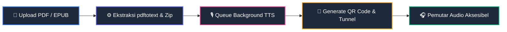

<div align="center">

<!-- Animated Header Wave Banner -->


<br />

<!-- Animated Typing SVG -->
<a href="https://github.com/Ayries18/Read-Assist">
  
</a>

<br />

<!-- Badges -->
[](tests/Feature/AudioBukuTest.php)
[](#-aksesibilitas-wcag-22)
[](LICENSE)

<br />

[](https://laravel.com)
[](https://php.net)
[](https://sqlite.org)
[](https://tailwindcss.com)
[](https://daisyui.com)
[](https://vitejs.dev)

</div>

---

## 📑 Daftar Isi

- [💡 Tentang Proyek](#-tentang-proyek)
- [🔄 Alur Kerja Sistem](#-alur-kerja-sistem)
- [✨ Fitur Utama](#-fitur-utama)
- [♿ Aksesibilitas (WCAG 2.2)](#-aksesibilitas-wcag-22)
- [⌨️ Pintasan Keyboard (Shortcuts)](#️-pintasan-keyboard-shortcuts)
- [🧰 Teknologi](#-teknologi)
- [🚀 Cara Menjalankan](#-cara-menjalankan)
- [🔑 Akun Uji Coba (Demo Accounts)](#-akun-uji-coba-demo-accounts)
- [⚙️ Konfigurasi Lingkungan](#️-konfigurasi-lingkungan)
- [📁 Struktur Direktori](#-struktur-direktori)
- [👤 Pengembang](#-pengembang)

---

## 💡 Tentang Proyek

**Read-Assist** adalah platform buku audio digital berbasis **Laravel 13** yang dirancang khusus untuk mempermudah penyandang **tunanetra (*visually impaired / blind users*)** dalam mengakses materi belajar dan literasi secara mandiri.

Pengguna cukup **memindai kode QR** yang tertera pada buku fisik menggunakan kamera smartphone. Sistem secara otomatis mendeteksi koneksi jaringan (publik/LAN) dan langsung memutar audio pembacaan buku kalimat demi kalimat dengan dukungan antarmuka berkontras tinggi dan kompatibel penuh dengan *Screen Reader* (TalkBack & VoiceOver).

---

## 🔄 Alur Kerja Sistem



1. **Unggah Dokumen**: Penulis atau admin mengunggah dokumen digital dalam format **PDF** atau **EPUB**.
2. **Ekstraksi Teks Otomatis**: Server mengekstrak seluruh teks secara presisi menggunakan `pdftotext` (`poppler-utils`) atau `ZipArchive`.
3. **Pemrosesan TTS Latar Belakang**: Teks dipecah menjadi kalimat dan diproses secara asinkron (*background queue*) menjadi audio MP3 utuh, dengan **progres real-time** (`audio_progress`/`audio_message`) yang dapat dipantau di halaman katalog & pemutar.
4. **Smart QR & Routing**: Setiap buku mendapatkan token UUID dan QR Code unik yang terhubung ke *SSH reverse tunnel* atau IP jaringan lokal.
5. **Akses Langsung**: Pengguna memindai QR Code dan langsung mendengarkan bacaan buku tanpa perlu navigasi yang rumit.

---

## ✨ Fitur Utama

| | Fitur | Keterangan |
| :---: | :--- | :--- |
| 📚 | **Ekstraksi Dokumen Cerdas** | Ekstraksi otomatis dari file **PDF** dan **EPUB** tanpa kehilangan struktur kalimat. |
| 🔊 | **Dual Audio Delivery System** | Pilihan mendengarkan via server-side MP3 berkualitas atau *client-side Web Speech Synthesis* kalimat-demi-kalimat. |
| 🎛️ | **Pemutar Gaya Spotify** | Kontrol melingkar khas aplikasi musik: tombol *Play/Pause*, kalimat sebelumnya/selanjutnya, dan **Skip ±10 detik** untuk audio MP3 hasil generasi. |
| 🗣️ | **Voice Commands (Kontrol Suara)** | Pemutar tunanetra dapat dikendalikan lewat suara via **Web Speech API** — perintah *play, pause, next, prev, stop, speed,* dan *settings* tanpa menyentuh layar. |
| 📡 | **Progres Generasi Audio Real-Time** | Status & persentase pembuatan audio ditampilkan langsung di halaman katalog & pemutar melalui kolom `audio_progress` / `audio_message` tanpa perlu *refresh*. |
| 📱 | **Smart QR Code Routing** | Terintegrasi dengan `TunnelService` (`localhost.run`) & IP LAN otomatis untuk akses instan dari ponsel di jaringan yang sama. |
| 🎧 | **Integrated & Mini Player** | Pemutar audio layar penuh + pemutar mini (*persistent*) yang tidak berhenti saat berpindah halaman. |
| 🔐 | **Reset Password via Email** | Pengguna dapat memulihkan akun lewat email *Password Reset* yang dikirim `PasswordResetMail`, dengan *fallback* generik bila SMTP tidak aktif. |
| 📊 | **Sinkronisasi Progres Mendengarkan** | Progres membaca disimpan secara otomatis di browser (*localStorage*) dan database pengguna. |
| 🔍 | **Asisten Ringkasan Teks (Read-Assist)** | Modul analisis teks pintar untuk menghitung jumlah kata, estimasi waktu baca, dan ringkasan isi buku. |

---

## ♿ Aksesibilitas (WCAG 2.2)

Aplikasi dibangun dan diverifikasi sesuai panduan **WCAG 2.2 Level AA / AAA**:

- 🟨 **Mode Kontras Tinggi**: Tema kontras tinggi hitam murni (`#000000`) dan kuning cerah (`#FBBF24`) dengan rasio kontras > 7:1.
- 🗣️ **Kompatibel TalkBack / VoiceOver**: Menggunakan landmark ARIA semantik, `aria-live="polite"` untuk notifikasi dinamis, dan `aria-label` deskriptif.
- 🚫 **Tanpa Auto-Play Acak**: Audio hanya diputar saat pengguna menekan tombol *Play* secara sadar (mencegah bentrokan dengan Screen Reader).
- 🔗 **Skip Navigation Link**: Tombol cepat untuk langsung melompat ke konten utama bagi pengguna keyboard.

---

## ⌨️ Pintasan Keyboard (Shortcuts)

Navigasi pemutar buku audio dapat dikendalikan sepenuhnya melalui keyboard:

| Tombol | Fungsi |
| :--- | :--- |
| <kbd>Space</kbd> | Memutar (*Play*) atau Menjeda (*Pause*) pembacaan suara |
| <kbd>→</kbd> (*Panah Kanan*) | Melompat ke **kalimat berikutnya** |
| <kbd>←</kbd> (*Panah Kiri*) | Kembali ke **kalimat sebelumnya** |
| <kbd>Esc</kbd> | Menghentikan pembacaan / Menutup modal pengaturan |

### 🗣️ Kontrol Suara (Voice Commands)

Selain keyboard, pemutar tunanetra dapat dikendalikan sepenuhnya dengan **perintah suara** menggunakan *Web Speech API* (`SpeechRecognition`) — berguna saat pengguna tidak dapat menyentuh layar. Aktifkan mikrofon dari pemutar, lalu ucapkan perintah berikut:

| Perintah | Fungsi |
| :--- | :--- |
| *"Play"* / *"Pause"* | Memulai atau menjeda pembacaan |
| *"Next"* / *"Prev"* | Pindah ke kalimat berikutnya / sebelumnya |
| *"Stop"* | Menghentikan pembacaan |
| *"Speed"* | Mengubah kecepatan suara |
| *"Settings"* | Membuka pengaturan pemutar |

> **Catatan**: Perintah suara bersifat *progressive enhancement* — jika browser tidak mendukung `SpeechRecognition`, semua kontrol tetap dapat diakses via keyboard & Screen Reader.

---

## 🧰 Teknologi

| Lapisan | Teknologi |
| :--- | :--- |
| **Backend Framework** | Laravel 13 (PHP 8.3+) |
| **Database** | SQLite (Default & In-Memory Test Suite) |
| **Frontend & Styling** | Blade Templates, Tailwind CSS v4, DaisyUI 5 |
| **Asset Bundler** | Vite 8 |
| **Audio & Ekstraksi** | `poppler-utils` (`pdftotext`), `ZipArchive`, Google Translate TTS Engine |
| **Tunneling & QR** | SSH Reverse Tunnel (`nokey@localhost.run`), Simple QrCode |

---

## 🚀 Cara Menjalankan

### Prasyarat
- **PHP 8.3+** & [Composer](https://getcomposer.org/)
- **Node.js 20+** & npm
- `poppler-utils` (`pdftotext`) — untuk ekstraksi teks dokumen PDF

### 1. Instalasi & Konfigurasi

```bash
# Clone repository
git clone https://github.com/Ayries18/Read-Assist.git
cd Read-Assist

# Install dependensi PHP & Node.js
composer install
npm install

# Konfigurasi file environment & database
cp .env.example .env
php artisan key:generate
touch database/database.sqlite
php artisan migrate:fresh --seed
```

### 2. Menjalankan Semua Layanan (Satu Perintah)

Jalankan server web, antrean worker, Vite hot-reload, dan SSH tunnel secara bersamaan:

```bash
composer run dev
```

Buka peramban di **http://127.0.0.1:8000** 🎉

### 3. Menjalankan Pengujian (Testing)

```bash
# Menjalankan seluruh 22 feature tests
php artisan test

# Menjalankan pengecekan code style (PSR-12)
vendor/bin/pint --test
```

---

## 🔑 Akun Uji Coba (Demo Accounts)

Database seeder telah menyediakan akun siap pakai:

| Role | Email | Password | Hak Akses |
| :--- | :--- | :--- | :--- |
| **Administrator** | `admin@example.com` | `password` | Akses penuh dashboard admin, kelola semua buku & regenerasi audio |
| **Pengguna (User)** | `muwarisin@gmail.com` | `Aris1234` | Akses katalog, unggah buku sendiri, dan simpan riwayat mendengarkan |

---

## ⚙️ Konfigurasi Lingkungan

Variabel utama yang dapat disesuaikan pada file `.env`:

| Variabel | Deskripsi | Default |
| :--- | :--- | :--- |
| `APP_URL` | Alamat URL utama aplikasi | `http://127.0.0.1:8000` |
| `DB_CONNECTION` | Driver database | `sqlite` |
| `QUEUE_CONNECTION` | Driver antrean latar belakang | `database` |
| `TTS_PROVIDER` | Provider Text-to-Speech | `google` |
| `TTS_TIMEOUT` | Batas waktu timeout permintaan TTS | `120` |

---

## 📁 Struktur Direktori

```text
Read-Assist/
├── app/
│   ├── Console/Commands/     # Artisan commands (tunnel:start, tunnel:stop, serve, qr:regenerate)
│   ├── Http/Controllers/     # Controller (AudioBuku, Auth, QRCode, ReadAssist)
│   ├── Http/Middleware/      # Middleware (RestrictQrGuest, SetContentLength)
│   ├── Jobs/                 # Queue jobs (GenerateBookAudio)
│   ├── Mail/                 # Email (PasswordResetMail — reset password)
│   ├── Models/               # Eloquent Models (AudioBuku, User, Admin, ListeningProgress, PasswordResetToken)
│   └── Services/             # TTSEngine, TunnelService, NineRouterService
├── config/                   # File konfigurasi aplikasi & TTS
├── database/                 # Migrasi database, factory, dan seeder
├── public/                   # Asset publik, logo, manifest PWA, service worker, & file QR
├── resources/
│   ├── css/                  # Styling tema, dark mode, dan mode kontras tinggi
│   ├── js/                   # Skrip pemutar audio Web Speech & sinkronisasi UI
│   └── views/                # Template Blade (katalog, player, auth, email, dashboard)
├── routes/                   # Routing web & konsol
├── storage/
│   ├── app/public/audio/     # Penyimpanan audio MP3 hasil generasi
│   └── app/public/qr/        # File gambar QR Code
└── tests/                    # Feature & Unit test suite (PHPUnit)
```

---

## 👤 Pengembang

<div align="center">

**Muhammad Almuwarisin**  
Mahasiswa Teknologi Informasi — Pengembang Sistem Aksesibilitas

[](https://github.com/Ayries18)

<br />

<!-- Animated Footer Wave -->


</div>
