<div align="center">


# Read-Assist

**Platform buku audio digital yang dapat diakses untuk penyandang tunanetra**

Buku digital (PDF/EPUB) diekstrak teksnya, dikonversi menjadi audio melalui Text-to-Speech, lalu diakses dengan cepat melalui QR Code — cukup dengan browser di smartphone atau komputer, tanpa aplikasi khusus.

</div>

<p align="center">
  <a href="https://readassist.web-id.id/"><strong>Buka Aplikasi</strong></a>
  &nbsp;·&nbsp;
  <a href="https://github.com/Ayries18/Read-Assist"><strong>Repository</strong></a>
</p>

<div align="center">


</div>

---

## Daftar Isi

- [Tentang Proyek](#tentang-proyek)
- [Preview](#preview)
- [Highlight](#highlight)
- [Tujuan](#tujuan)
- [Cara Kerja](#cara-kerja)
- [Fitur Utama](#fitur-utama)
- [Aksesibilitas](#aksesibilitas)
- [Arsitektur](#arsitektur)
- [Teknologi](#teknologi)
- [Demo](#demo)
- [Persyaratan](#persyaratan)
- [Instalasi](#instalasi)
- [Konfigurasi](#konfigurasi)
- [Menjalankan Aplikasi](#menjalankan-aplikasi)
- [Ekstraksi PDF & EPUB](#ekstraksi-pdf--epub)
- [Text-to-Speech](#text-to-speech)
- [Pengujian](#pengujian)
- [Struktur Proyek](#struktur-proyek)
- [Deployment](#deployment)
- [Keamanan](#keamanan)
- [Pengembang](#pengembang)
- [Lisensi](#lisensi)

---

## Tentang Proyek

**Read-Assist** adalah platform akses pembelajaran berbasis web yang membantu penyandang tunanetra mengakses materi pembelajaran dalam bentuk audio secara lebih mandiri.

Proyek ini menjawab dua persoalan:

1. **Buku digital belum tentu bisa "dibaca" dengan mudah** oleh penyandang tunanetra — teks perlu diubah menjadi audio.
2. **Buku fisik sulit dihubungkan ke konten digitalnya** — diperlukan jembatan yang sederhana dan bisa dijangkau siapa saja.

Read-Assist menghubungkan **buku fisik dengan audio digital melalui QR Code unik**. Administrator (atau pengguna yang login) mengunggah buku dalam format **PDF atau EPUB**. Sistem mengekstrak teks, memprosesnya menggunakan **Text-to-Speech (TTS)**, lalu menghasilkan audio buku yang dapat didengarkan di browser.

Cara pakai dari sisi pengguna cukup singkat:

1. Memindai QR Code yang ditempel pada buku.
2. Halaman pemutar terbuka di smartphone atau komputer.
3. Materi dibacakan melalui audio player (MP3 hasil generasi) atau Web Speech API sebagai fallback.
4. Pembacaan dapat dilanjutkan dari posisi terakhir.

**Tidak diperlukan aplikasi khusus.** Selama perangkat memiliki browser yang mendukung fitur yang dipakai (audio HTML5 / Web Speech API), materi dapat digunakan langsung.

### Target Pengguna

- Penyandang tunanetra.
- Pengguna *screen reader* (TalkBack, VoiceOver).
- Pengguna smartphone dengan TalkBack.
- Pengguna yang membutuhkan alternatif audio untuk membaca materi.
- Institusi atau pengelola materi pembelajaran yang menyediakan aksesibilitas.

---

## Preview

Repository ini **tidak menyertakan file tangkapan layar** (screenshot) aplikasi, sehingga tidak ada pratinjau gambar di README.

Versi production aplikasi dapat langsung dicoba secara daring:

- **Live website:** <https://readassist.web-id.id/>

Coba alur lengkapnya: unggah buku → tunggu audio ter-generate → pindai QR → dengarkan. Untuk melihat antarmuka pemutar tanpa membuka produksi, aplikasi juga dapat dijalankan secara lokal melalui panduan pada bagian [Instalasi](#instalasi).

---

## Highlight

| Fitur | Manfaat |
| :--- | :--- |
| **Accessibility First** | Kontras tinggi, ukuran teks besar, navigasi keyboard, skip link, ARIA, dan suara pendamping. |
| **PDF & EPUB** | Dua format buku digital yang paling umum diekstrak otomatis menjadi teks. |
| **Automatic TTS** | Audio dibuat otomatis di latar belakang (queue) dan digabung menjadi satu file `full.mp3`. |
| **QR Code Access** | Setiap buku punya QR ber-*token* unik; pemindaian langsung membuka halaman audio buku terkait. |
| **Voice Control** | Pemutar dapat dioperasikan dengan perintah suara Bahasa Indonesia (play, pause, next, stop, dan lainnya). |
| **Reading Progress** | Posisi kalimat disimpan di `localStorage` dan disinkronkan ke database untuk pengguna yang login. |
| **PWA** | `<manifest.json>` + service worker sehingga aplikasi dapat diinstal ke perangkat. |

---

## Tujuan

- Menyediakan **akses pembelajaran** berbasis audio bagi penyandang tunanetra.
- Mendorong **kemandirian** pengguna dalam mengakses materi tanpa bantuan orang lain.
- Menghubungkan **buku fisik ke audio digital** melalui QR Code sederhana.
- Mendukung input **PDF dan EPUB** yang diekstrak teksnya secara otomatis.
- Bisa diakses melalui **browser** di berbagai perangkat, tanpa aplikasi terpisah.
- Ramah terhadap **screen reader / TalkBack** dan navigasi keyboard, mengikuti prinsip WCAG.

---

## Cara Kerja

```mermaid
flowchart LR
    A[Unggah PDF / EPUB] --> B[Ekstraksi teks]
    B --> C[Job GenerateBookAudio]
    C --> D[TTSEngine: pecah kalimat]
    D --> E[Google Translate TTS per kalimat]
    E --> F[MP3 chunks]
    F --> G[full.mp3]
    B --> H[QR Code UUID -> /scan/book/&#123;qr_token&#125;]
    G --> I[Pemutar: MP3 HTML5]
    H --> J[Akses via QR / katalog]
    J --> K[Web Speech API sebagai fallback]
    I --> L[Progress: localStorage + ListeningProgress]
    K --> L
```



Langkah-langkahnya:

1. **Unggah buku** — Admin atau user mengunggah dokumen **PDF / EPUB** (maks. 50 MB) melalui form unggah. Validasi mime (`mimes:pdf,epub`) dan ekstraksi teks dilakukan langsung saat unggah.
2. **Ekstraksi teks** — Konten diekstrak otomatis: PDF diparse dengan `smalot/pdfparser`, EPUB dibaca sebagai ZIP (`ZipArchive`) lalu tag HTML-nya dibuang.
3. **Antrean generasi audio** — Job `GenerateBookAudio` dikirim ke queue (`QUEUE_CONNECTION=database`). Job ini memecah teks menjadi kalimat dan mengirim tiap kalimat ke TTS.
4. **Text-to-Speech** — `TTSEngine` memanggil endpoint Google Translate TTS untuk menghasilkan MP3 per kalimat (bahasa `id`, hingga 3 percobaan dengan *exponential backoff*).
5. **Perakitan audio** — Potongan MP3 kalimat digabungkan (`concatAudio()`) menjadi satu file `full.mp3` di `storage/app/public/audio/`.
6. **QR Code & routing** — Setiap buku memiliki `qr_token` (UUID). QR mengarah ke `/scan/book/{qr_token}`. URL target dipilih dinamis (domain publik → SSH tunnel → IP LAN) sesuai lingkungan.
7. **Akses pengguna** — Pemindaian QR atau kunjungan dari katalog membuka halaman pemutar.
8. **Pemutaran** — Jika `full.mp3` sudah tersedia, dipakai elemen `audio` HTML5; jika belum, aplikasi memakai **Web Speech API** untuk membacakan teks kalimat demi kalimat.
9. **Progress** — Posisi kalimat tersimpan di `localStorage` dan disinkronkan ke server (`ListeningProgress`) bagi pengguna yang login.

---

## Fitur Utama

### Manajemen Buku

| Fitur | Keterangan |
| :--- | :--- |
| Katalog buku | Halaman katalog dengan pagination (6 buku per halaman). |
| Pencarian | Pencarian berdasarkan judul, penulis, atau kategori. |
| Filter | Filter berdasarkan kategori. |
| Sorting | Pengurutan terbaru, terlama, atau berdasarkan judul. |
| Upload PDF/EPUB | Batas maks. **50 MB**, validasi `mimes:pdf,epub`. |
| Ekstraksi PDF | Dengan `smalot/pdfparser`. |
| Ekstraksi EPUB | Dengan `ZipArchive` + `strip_tags` pada berkas `.html`/`.xhtml` internal. |
| Retry audio | Mengulang proses generasi audio untuk buku tertentu (`retry-audio`). |

### Generasi Audio

| Fitur | Keterangan |
| :--- | :--- |
| Queue `GenerateBookAudio` | Diproses di latar belakang (driver `database`, `tries: 1`, `timeout: 600`). |
| Progress & status real-time | `audio_progress`, `audio_status`, `audio_message` ditampilkan di halaman buku. |
| `full.mp3` | Semua potongan MP3 kalimat digabung menjadi satu file utuh. |
| Streaming | Endpoint `/audio-stream/{audioBook}` untuk audio MP3. |
| Fallback Web Speech API | Bila audio belum/jadi gagal dibuat, teks dibacakan kalimat demi kalimat. |

### QR Code

| Fitur | Keterangan |
| :--- | :--- |
| Token unik | `qr_token` berupa UUID per buku. |
| File QR | Disimpan sebagai SVG di `storage/app/public/qr/qr-book-{id}.svg`. |
| Regenerasi | Command `php artisan qr:regenerate` (semua buku atau `--id=`). |
| Routing dinamis | URL QR menyesuaikan lingkungan (domain publik / tunnel / LAN). |

### Pemutar & Interaksi

| Fitur | Keterangan |
| :--- | :--- |
| Audio player | Elemen `audio` HTML5 dengan lompat **±10 detik**. |
| Web Speech API | `SpeechSynthesisUtterance` (bahasa `id-ID`) untuk pembacaan kalimat demi kalimat. |
| Kontrol suara | `SpeechRecognition` dengan perintah Bahasa Indonesia (play, pause, next, prev, stop, dan lainnya). |
| Pintasan keyboard | `Space` (play/pause), `ArrowLeft`/`ArrowRight` (kalimat), `Escape` (berhenti/tutup). |
| Swipe gesture | Geser kiri/kanan untuk pindah kalimat pada perangkat layar sentuh. |
| Mini player | Pemutar mini yang tetap muncul saat pengguna berpindah halaman. |

### Progress & Pengaturan

| Fitur | Keterangan |
| :--- | :--- |
| Progress lokal | Posisi kalimat di `localStorage` untuk semua pengunjung. |
| Progress server | `ListeningProgress` untuk pengguna login (yang di-sync lewat `/progress/sync/`). |
| Kecepatan baca | 0.75x, 1x, 1.25x, 1.5x, 2.0x — tersimpan di perangkat. |
| Ukuran font | Pilihan ukuran teks pada pemutar. |
| Kontras | Mode kontras tersendiri di halaman pemutar. |

### Aksesibilitas & Tampilan

| Fitur | Keterangan |
| :--- | :--- |
| High contrast | Latar hitam (`#000000`) dengan aksen kuning (`#ffff00`). |
| Ukuran teks global | A / A+ / A++ dari panel aksesibilitas. |
| Suara pendamping | Membacakan label elemen saat fokus/hover (bisa dimatikan). |
| Tema | Terang / gelap / ikuti sistem, disimpan di perangkat. |
| Tanpa autoplay | Audio hanya diputar setelah pengguna menekan play. |

### Otentikasi & Akun

| Fitur | Keterangan |
| :--- | :--- |
| Dua peran | Admin dan user, dengan dashboard terpisah masing-masing. |
| Custom session auth | Status login diperiksa via sesi (`auth_id`, `auth_role`, `auth_name`), bukan guard bawaan Laravel. |
| Registrasi | Mendukung membuat akun admin maupun user. |
| Profil | Ubah nama, email, dan password. |
| Reset password | Email `PasswordResetMail` + token kedaluwarsa 60 menit. |
| Ownership check | Hanya admin atau pemilik buku (`user_id`) yang dapat mengedit/menghapus. |

### Lainnya

| Fitur | Keterangan |
| :--- | :--- |
| Read-Assist text analysis | Analisis teks secara lokal (PHP): jumlah kata, jumlah kalimat, ringkasan 2 kalimat, dan 5 kata kunci. |
| Guest QR restriction | Pengunjung tidak login yang datang via QR hanya diizinkan mengakses buku terkait (cegah IDOR). |
| PWA | `public/manifest.json` + `public/sw.js` — aplikasi dapat diinstal. |

---

## Aksesibilitas

Read-Assist dibangun dengan mengacu pada prinsip **WCAG 2.2** dan mengutamakan kemudahan penggunaan bagi pengguna pembaca layar (TalkBack, VoiceOver) serta navigasi keyboard.

### Yang diterapkan

- **Semantic landmarks** — struktur `<nav>`, `<main>`, `<footer>` untuk memudahkan navigasi pembaca layar.
- **ARIA** — `aria-label` deskriptif pada kontrol interaktif, `aria-live="polite"` + `aria-atomic` untuk teks yang sedang dibacakan dan pesan status, serta `role="status"` pada notifikasi.
- **Skip link** — tautan "Lewati ke konten utama" di awal halaman untuk pengguna keyboard.
- **Navigasi keyboard** — `Space` play/pause, `ArrowLeft`/`ArrowRight` pindah kalimat, `Escape` berhenti/menutup modal.
- **Focus management** — fokus berpindah ke elemen pertama saat modal/drawer dibuka dan kembali ke tombol pemicu saat ditutup; *focus trap* pada drawer mobile.
- **High contrast** — latar hitam (`#000000`) dan aksen kuning (`#ffff00`) dengan `!important` untuk menjamin kontras pada seluruh elemen.
- **Ukuran teks** — A / A+ / A++ dari panel aksesibilitas navbar atau tombol mengambang.
- **Suara pendamping** — membacakan label/sebutan elemen saat di-hover/fokus (dapat dimatikan; disarankan nonaktif bagi pengguna TalkBack).
- **Kontrol suara** — perintah lisan Bahasa Indonesia untuk mengoperasikan pemutar tanpa menyentuh layar.
- **Tanpa autoplay** — audio hanya diputar saat pengguna menekan tombol play secara sadar, mencegah bentrokan dengan pembaca layar.

### Disclaimer

Repository ini **belum menyertakan tooling pengujian aksesibilitas otomatis** (misalnya axe-core atau Playwright). Oleh karena itu:

- Tidak ada klaim skor atau hasil *automated accessibility test* tertentu.
- Implementasi dibuat **dengan mengacu pada prinsip WCAG 2.2**, tetapi **tidak mengklaim sertifikasi atau kepatuhan penuh (fully compliant)** terhadap standar tersebut.

---

## Arsitektur

Alur permintaan berjalan secara umum sebagai berikut:

```text
Browser
  → Routes (routes/web.php)
    → Controllers (Http/Controllers)
      → Jobs / Services (GenerateBookAudio, TTSEngine, TunnelService)
        → Models / Database / Storage
```

### Komponen utama

| Komponen | Peran |
| :--- | :--- |
| `AudioBuku` (model) | Representasi buku audio: metadata, file, status audio, `qr_token`. |
| `Auth` (AuthController) | Login/register/logout berbasis sesi, profil, dan reset password. |
| `QRCode` (QRCodeController & `AudioBukuController`) | Pembuatan/generasi QR dan routing `/scan/book/{qr_token}`. |
| `ReadAssist` (ReadAssistController) | Analisis teks (statistik kalimat/kata, ringkasan, keyword) di `/read-assist`. |
| `GenerateBookAudio` (job) | Ekstraksi teks dan generasi audio penuh secara berurutan per kalimat. |
| `TTSEngine` (service) | Pemanggilan endpoint TTS, pemecahan kalimat, dan penggabungan MP3. |
| `TunnelService` (service) | SSH reverse tunnel (`localhost.run`) + fallback Ngrok/LAN untuk URL QR. |
| `ListeningProgress` (model) | Simpan posisi kalimat per user per buku. |
| Middleware | `EnsureAuthenticated` (sesi), `RestrictQrGuest` (pembatasan guest QR), `SetContentLength`. |

---

## Teknologi

| Aspek | Teknologi |
| :--- | :--- |
| Framework | Laravel 13 (`laravel/framework: ^13.8`) |
| Bahasa | PHP 8.3+ |
| Template | Blade |
| Frontend scripting | JavaScript vanila (Web Speech API: `SpeechSynthesis`, `SpeechRecognition`) |
| Styling | Tailwind CSS v4 (`tailwindcss: ^4.0.0`) + DaisyUI 5 (`daisyui: ^5.5.20`) |
| Asset bundler | Vite 8 (`vite: ^8.0.0`, `laravel-vite-plugin: ^3.1`) |
| Database | SQLite (default `database/database.sqlite`); `:memory:` untuk pengujian |
| HTTP client | Guzzle (`guzzlehttp/guzzle: ^7.10`) |
| Ekstraksi PDF | `smalot/pdfparser: ^2.12` |
| Ekstraksi EPUB | PHP `ZipArchive` (bawaan) |
| Text-to-Speech | Endpoint Google Translate TTS (nonresmi) `translate.google.com/translate_tts` (`client=tw-ob`) |
| QR Code | `simplesoftwareio/simple-qrcode: ^4.2` |
| Antrean | Laravel Queue (driver `database`) |
| Tunneling | SSH reverse tunnel (`localhost.run`), dengan deteksi fallback Ngrok & IP LAN |
| Testing | PHPUnit `^12.5` (`php artisan test`) |
| Code style | Laravel Pint `^1.27` (PSR-12) |
| Accessibility testing | Tidak ada tooling otomatis di repository (lihat [Aksesibilitas](#aksesibilitas)) |

---

## Demo

Aplikasi production dapat dicoba di:

<p align="center">
  <a href="https://readassist.web-id.id/"><strong>→ https://readassist.web-id.id/</strong></a>
</p>

Akun demo untuk role **admin** dan **user** dibuat secara lokal melalui seeder:

```bash
php artisan migrate:fresh --seed
```

Peran dan data akun contoh dapat dilihat pada `database/seeders/DatabaseSeeder.php`. Kredensial akun untuk lingkungan development tidak dicantumkan di README publik ini.

---

## Persyaratan

| Keperluan | Keterangan |
| :--- | :--- |
| PHP | 8.3+ |
| Composer | 2.x |
| Node.js & npm | Untuk Vite / asset frontend |
| Ekstensi PHP | `zip` (EPUB/`ZipArchive`), `pdo_sqlite` (SQLite), `gd` (opsional — di Docker sudah diinstal), `mbstring`, `fileinfo` |
| SSH client | Hanya dibutuhkan untuk mode tunnel publik (`php artisan tunnel:start`) |
| `poppler-utils` | **Bukan** kebergantungan kode — ekstraksi PDF dilakukan oleh `smalot/pdfparser` di dalam PHP. (`poppler-utils` hanya terpasang di Dockerfile sebagai utilitas sistem pelengkap.) |

---

## Instalasi

```bash
# 1. Clone repository
git clone https://github.com/Ayries18/Read-Assist.git
cd Read-Assist

# 2. Install dependensi PHP dan JavaScript
composer install
npm install

# 3. Siapkan environment
cp .env.example .env
php artisan key:generate

# 4. Buat database SQLite lalu jalankan migrasi + seeder
touch database/database.sqlite
php artisan migrate:fresh --seed
```

Skrip setup otomatis juga tersedia di `composer.json`:

```bash
composer run setup
```

---

## Konfigurasi

Variabel utama pada file `.env` (lihat `.env.example` untuk daftar lengkap):

| Variabel | Deskripsi | Contoh |
| :--- | :--- | :--- |
| `APP_NAME` | Nama aplikasi | `Read-Assist` |
| `APP_ENV` | Lingkungan aplikasi | `local` / `production` |
| `APP_DEBUG` | Mode debug (matikan di produksi) | `true` / `false` |
| `APP_URL` | URL aplikasi (basis QR & email) | `http://127.0.0.1:8000` |
| `APP_LOCALE` | Bahasa UI | `id` |
| `DB_CONNECTION` | Driver database | `sqlite` (atau `mysql` di produksi) |
| `SESSION_DRIVER` | Driver sesi | `database` |
| `SESSION_LIFETIME` | Umur sesi (menit) | `120` |
| `QUEUE_CONNECTION` | Driver antrean | `database` |
| `CACHE_STORE` | Driver cache | `database` |
| `MAIL_MAILER` | Mailer (local: `log`) | `log` / `smtp` |
| `MAIL_FROM_ADDRESS` | Pengirim email | `hello@example.com` |
| `TTS_PROVIDER` | Provider TTS | `google` |
| `TTS_TIMEOUT` | Timeout (detik) permintaan TTS | `120` |
| `GOOGLE_TTS_URL` | Endpoint Google Translate TTS | <https://translate.google.com/translate_tts> |
| `TUNNEL_PORT` | Port untuk SSH tunnel | `8000` |

> Jangan menaruh kredensial rahasia di repository. Kunci seperti `NINEROUTER_KEY` hanya diisi melalui environment di sisi server (`NINEROUTER_*` tersedia sebagai layanan opsional, tetapi tidak dipakai pada alur TTS aplikasi).

---

## Menjalankan Aplikasi

### Satu perintah (semua layanan)

Jalankan server web, queue worker (TTS), Vite hot-reload, dan SSH tunnel secara paralel:

```bash
composer run dev
```

Buka [http://127.0.0.1:8000](http://127.0.0.1:8000).

### Per layanan

```bash
php artisan serve                  # Web server (bind 0.0.0.0, buka browser otomatis)
npm run dev                        # Vite hot-reload (development)
php artisan queue:listen --tries=1 --timeout=0   # Queue worker untuk generasi audio
php artisan tunnel:start           # SSH tunnel publik (akses QR dari jaringan luar)
```

Catatan:

- **Queue worker wajib berjalan** agar generasi audio otomatis berfungsi.
- `php artisan serve` dimodifikasi agar bind ke `0.0.0.0` sehingga dapat diakses dari perangkat lain di jaringan LAN (misalnya HP saat memindai QR).

---

## Ekstraksi PDF & EPUB

- **PDF** — Diparse sepenuhnya di dalam PHP oleh `smalot/pdfparser` (`Parser::parseFile()` → `getText()`). Hasil dibersihkan: normalisasi encoding UTF-8, `html_entity_decode`, serta perapian spasi dan baris.
- **EPUB** — Dibuka sebagai arsip ZIP (`ZipArchive`). Seluruh berkas `.html` / `.xhtml` internal dibaca, tag-strip dengan `strip_tags`, lalu digabung menjadi teks. Ada pembatas keamanan **5.000.000 karakter** untuk mencegah file berukuran besar.
- **Text cleaning** — `mb_check_encoding`, `mb_convert_encoding`, `iconv(UTF-8//IGNORE)`, `html_entity_decode`, normalisasi whitespace, dan perapian baris kosong.
- **Error handling** — Jika teks hasil ekstraksi kosong (misalnya PDF hasil scan gambar), unggahan ditolak dengan pesan yang jelas. Saat generasi audio, jika file tidak terbaca, job memakai **deskripsi buku** sebagai fallback; bila teks tetap kosong, status diubah menjadi `failed`.

Implementasi terdapat di `app/Jobs/GenerateBookAudio.php` dan `app/Http/Controllers/AudioBukuController.php`.

---

## Text-to-Speech

Implementasi ada di `app/Services/TTSEngine.php` dan dijalankan oleh job `app/Jobs/GenerateBookAudio.php`.

### Endpoint

- **Google Translate TTS endpoint** (nonresmi): `https://translate.google.com/translate_tts`
- Parameter: `ie=UTF-8`, `client=tw-ob`, `tl=id` (Bahasa Indonesia).
- Dikonfigurasi melalui `config/tts.php` (`TTS_PROVIDER=google`).

### Alur permintaan

- **Pemecahan teks** — `splitSentences()` membagi paragraf menjadi kalimat (batas `.`, `!`, `?`); kalimat panjang dipecah lagi menjadi segmen **maks. 150 karakter** (`ide_chars`). Kalimat pembuka "Membaca buku: {judul}." ditambahkan otomatis.
- **Batas per permintaan** — **maks. 180 karakter** (`max_chars`); teks yang lebih panjang dipecah per kata menjadi beberapa potongan MP3 lalu digabung.
- **Timeout** — **120 detik** per permintaan (`TTS_TIMEOUT`, `config('tts.timeout')`).
- **Retry** — hingga **3 percobaan** per potongan dengan **exponential backoff** (0,5 detik → 1 detik).
- **Delay antar kalimat** — `usleep(150000)` (**150 ms**) di antara kalimat untuk meredam request beruntun ke endpoint eksternal.
- **Penggabungan** — `concatAudio()` menggabungkan raw MP3 tiap kalimat menjadi satu file `full.mp3` (atau menyalin file bila hanya satu kalimat).

### Catatan penting

Read-Assist **tidak menggunakan OpenAI, Gemini, atau LLM lain sebagai provider TTS** pada alur ini. Seluruh sintesis suara dilakukan melalui endpoint Google Translate TTS (`client=tw-ob`) yang dipanggil langsung oleh `TTSEngine`.

---

## Pengujian

Konfigurasi PHPUnit (`phpunit.xml`) memakai SQLite in-memory (`:memory:`), queue sinkron, sesi array, dan mail array saat testing.

Hasil aktual suite (diverifikasi saat penulisan README ini): **29 test passed, 65 assertions**.

```bash
# Menjalankan seluruh suite
php artisan test

# Alternatif via composer (config:clear + test)
composer test

# File test tertentu
php artisan test tests/Feature/AudioBukuTest.php

# Satu metode test tertentu
php artisan test --filter=test_user_can_login

# Pengecekan format kode (PSR-12)
vendor/bin/pint --test

# Menerapkan perbaikan format otomatis
vendor/bin/pint
```

---

## Struktur Proyek

```text
Read-Assist/
├── app/
│   ├── Console/Commands/         # serve (LAN-aware), tunnel:start/stop, qr:regenerate
│   ├── Http/
│   │   ├── Controllers/          # AudioBuku, Auth, ReadAssist, QRCode
│   │   └── Middleware/           # EnsureAuthenticated, RestrictQrGuest, SetContentLength
│   ├── Jobs/                     # GenerateBookAudio (queue TTS)
│   ├── Mail/                     # PasswordResetMail
│   ├── Models/                   # AudioBuku, User, Admin, ListeningProgress, PasswordResetToken
│   ├── Providers/                # AppServiceProvider
│   └── Services/                 # TTSEngine, TunnelService, NineRouterService
├── bootstrap/                    # Bootstrapping & registrasi middleware
├── config/                       # Konfigurasi (termasuk config/tts.php, config/services.php)
├── database/
│   ├── factories/                # UserFactory, AudioBukuFactory
│   ├── migrations/               # Skema users, admin, audio_buku, sessions, dll.
│   └── seeders/                  # DatabaseSeeder
├── public/                       # logo-horizontal.png, manifest.json, sw.js, favicon, build/ (Vite)
├── resources/
│   ├── css/                      # Tailwind & tema (accessibility.css, dark-mode.css, dll.)
│   ├── js/                       # Entry Vite
│   └── views/                    # Blade: layout, auth, katalog, player, read-assist
├── routes/
│   ├── web.php                   # Seluruh route aplikasi
│   └── console.php
├── storage/app/public/
│   ├── audio/                    # MP3 per buku (sentence_NNNN.mp3, full.mp3)
│   └── qr/                       # QR Code SVG per buku
├── tests/
│   ├── Feature/                  # AudioBukuTest.php
│   └── Unit/
├── .env.example
├── composer.json
├── Dockerfile
├── package.json
└── vite.config.js
```

---

## Deployment

Repository menyediakan **Dockerfile** berbasis `php:8.3-apache`:

- Base image: `php:8.3-apache`.
- Ekstensi PHP yang diinstal: `gd`, `pdo`, `pdo_mysql`, `bcmath`, `zip` (plus utilitas sistem `poppler-utils`, `zip`, `unzip`, `git`).
- Document root Apache diarahkan ke `/var/www/html/public` dan `mod_rewrite` diaktifkan.
- `composer install --no-interaction --optimize-autoloader --no-dev`.
- Permissions `storage` dan `bootstrap/cache` diarahkan ke `www-data`.
- Port yang diekspos: **80**.

```bash
# Contoh build & run Docker
docker build -t read-assist .
docker run -p 8080:80 read-assist
```

Aplikasi production: **https://readassist.web-id.id/**

> Repository tidak menyertakan konfigurasi deployment spesifik provider (mis. `render.yaml` / `Procfile`). Penyesuaian production (mis. `APP_ENV=production`, `APP_DEBUG=false`, mailer SMTP, HTTPS) dilakukan melalui environment di sisi server.

---

## Keamanan

Praktik keamanan yang diterapkan:

- **`.env` tidak masuk git** — seluruh kredensial (termasuk kunci SMTP dan `NINEROUTER_KEY`) hanya diisi di server.
- **`APP_DEBUG`** — dimatikan di production agar tidak membocorkan detail error/stack trace.
- **Validasi unggah** — hanya `mimes:pdf,epub`, maks. **50 MB**; file dengan teks yang tidak terbaca ditolak saat unggah.
- **Otentikasi berbasis sesi** — login state disimpan di sesi (`auth_id`, `auth_role`) dan divalidasi middleware, bukan data yang dikirim dari sisi klien.
- **Ownership check** — hanya **admin** atau **pemilik buku** (`user_id`) yang dapat mengedit, memperbarui, atau menghapus buku.
- **QR guest restriction** — pengunjung tidak login yang masuk lewat QR hanya diizinkan mengakses buku miliknya (`RestrictQrGuest`), mencegah akses lintas buku (IDOR).
- **Rate limiting** — login (5/menit), register (3/menit), kirim link reset (3/menit), proses reset (5/menit) via middleware `throttle`.
- **CSRF** — proteksi token CSRF aktif pada seluruh form.
- **Token reset password** — kedaluwarsa **60 menit** dan langsung dihapus setelah dipakai (one-time).

> Klaim keamanan di atas didasarkan pada implementasi aktual. Tidak ada pernyataan "100% secure" atau jaminan keamanan absolut.

---

## Pengembang

**Muhammad Almuwarisin**

- GitHub: [https://github.com/Ayries18](https://github.com/Ayries18)
- Portofolio: [https://ayries18.github.io/Portofolio/](https://ayries18.github.io/Portofolio/)
- LinkedIn: [https://www.linkedin.com/in/muhammad-almuwarisin-934079376/](https://www.linkedin.com/in/muhammad-almuwarisin-934079376/)

---

## Lisensi

Proyek ini dilisensikan di bawah **MIT License** (dinyatakan pada `composer.json`).

> Catatan: file `LICENSE` belum tersedia di repository. Penegakan lisensi mengacu pada deklarasi pada `composer.json` dan metadata distribusi Composer.