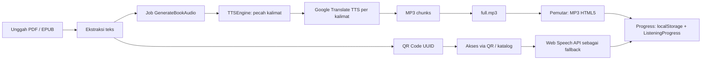

<div align="center">


# Read-Assist

**Jadikan buku digital apa pun bisa didengar — cukup pindai QR Code, tanpa aplikasi khusus.**

Buku **PDF/EPUB** diekstrak teksnya, dikonversi menjadi audio melalui Text-to-Speech, lalu diakses dari smartphone atau komputer lewat QR Code unik. Dibangun dengan aksesibilitas WCAG 2.2 sebagai fondasi, bukan pelengkap.

</div>

<p align="center">
  <a href="https://readassist.web-id.id/"><strong>Buka Aplikasi</strong></a>
  &nbsp;·&nbsp;
  <a href="https://github.com/Ayries18/Read-Assist"><strong>Repository</strong></a>
</p>

<div align="center">


</div>

---

## Preview

<table>
  <tr>
    <td width="50%"></td>
    <td width="50%"></td>
  </tr>
  <tr>
    <td></td>
    <td></td>
  </tr>
</table>

> Screenshot belum disertakan pada repository. Rujukan gambar di atas disiapkan untuk path `docs/images/home.png`, `catalog.png`, `player.png`, dan `accessibility.png`.

Demo daring yang dapat langsung dicoba: **https://readassist.web-id.id/**

---

## Daftar Isi

- [Preview](#preview)
- [Quick Start](#quick-start)
- [Tentang Proyek](#tentang-proyek)
- [Fitur](#fitur)
- [Cara Kerja](#cara-kerja)
- [Aksesibilitas](#aksesibilitas)
- [Teknologi](#teknologi)
- [Demo](#demo)
- [Persyaratan](#persyaratan)
- [Konfigurasi](#konfigurasi)
- [Menjalankan Aplikasi](#menjalankan-aplikasi)
- [Pengujian](#pengujian)
- [Struktur Proyek](#struktur-proyek)
- [Deployment](#deployment)
- [Keamanan](#keamanan)
- [Kontribusi](#kontribusi)
- [Pengembang](#pengembang)
- [Lisensi](#lisensi)

---

## Quick Start

```bash
git clone https://github.com/Ayries18/Read-Assist.git
cd Read-Assist
composer install
npm install
cp .env.example .env
php artisan key:generate
php artisan migrate:fresh --seed
composer run dev
```

Buka **http://127.0.0.1:8000**. `composer run dev` menjalankan web server, queue worker (TTS), Vite, dan SSH tunnel sekaligus.

> **Queue worker wajib berjalan** agar generasi audio otomatis berfungsi. Detail tiap layanan ada di [Menjalankan Aplikasi](#menjalankan-aplikasi).

---

## Tentang Proyek

Read-Assist menjawab dua persoalan nyata:

1. **Buku digital belum tentu bisa "dibaca"** oleh penyandang tunanetra — teks harus diubah menjadi audio.
2. **Buku fisik sulit dihubungkan ke konten digitalnya** — diperlukan jembatan sederhana yang bisa dijangkau siapa saja.

Alur dari sisi pengguna singkat: pindai QR Code pada buku → halaman pemutar terbuka di smartphone atau komputer → materi dibacakan sebagai MP3 (dengan Web Speech API sebagai fallback) → posisi bacaan terakhir tersimpan dan bisa dilanjutkan.

**Tidak ada aplikasi khusus yang perlu diunduh.** Selama browser mendukung HTML5 audio atau Web Speech API, materi langsung bisa dipakai.

**Target pengguna:** penyandang tunanetra, pengguna screen reader (TalkBack/VoiceOver), pengguna smartphone dengan TalkBack, serta institusi atau pengelola materi pembelajaran yang menyediakan aksesibilitas.

---

## Fitur

| Fitur | Manfaat |
| :--- | :--- |
| **Accessibility First** | Kontras tinggi, ukuran teks A/A+/A++, skip link, ARIA landmarks, navigasi keyboard, dan suara pendamping. |
| **PDF & EPUB** | Dua format buku digital paling umum diekstrak otomatis menjadi teks. |
| **Automatic TTS** | Audio dibuat di latar belakang (queue) dan digabung menjadi satu file `full.mp3`. |
| **QR Code Access** | Setiap buku punya QR ber-`token` UUID; pemindaian langsung membuka halaman audio buku tersebut. |
| **Voice Control & Keyboard** | Perintah suara Bahasa Indonesia, pintasan `Space`/`ArrowLeft`/`ArrowRight`/`Escape`, dan swipe gesture. |
| **Reading Progress** | Posisi kalimat disimpan di `localStorage` dan disinkronkan ke database untuk pengguna yang login. |

Fitur di atas diringkas. Rincian per modul ada di bagian yang dapat dibuka berikut:

<details>
<summary><strong>Detail fitur per modul (klik untuk membuka)</strong></summary>

**Manajemen Buku** — katalog dengan pagination (6 buku per halaman), pencarian judul/penulis/kategori, filter kategori, sorting (terbaru/terlama/judul), unggah PDF/EPUB maks. 50 MB dengan validasi `mimes:pdf,epub`, ekstraksi PDF via `smalot/pdfparser`, ekstraksi EPUB via `ZipArchive` + `strip_tags`, serta aksi retry audio (`retry-audio`).

**Generasi Audio** — job `GenerateBookAudio` diproses di latar belakang (driver `database`, `tries: 1`, `timeout: 600`), dengan status real-time (`audio_progress`, `audio_status`, `audio_message`) di halaman buku. Potongan MP3 kalimat digabung menjadi `full.mp3` dan dilayani melalui endpoint `/audio-stream/{audioBook}`. Bila audio belum tersedia, teks dibacakan kalimat demi kalimat lewat Web Speech API.

**QR Code** — `qr_token` berupa UUID per buku, file QR disimpan sebagai SVG di `storage/app/public/qr/qr-book-{id}.svg`, dapat diregenerasi dengan `php artisan qr:regenerate` (semua buku atau `--id=`), dan URL-nya menyesuaikan lingkungan (domain publik / tunnel / LAN).

**Pemutar & Interaksi** — elemen `audio` HTML5 dengan lompat ±10 detik, `SpeechSynthesisUtterance` (bahasa `id-ID`), `SpeechRecognition` untuk perintah suara, pintasan keyboard, swipe gesture, dan mini player yang tetap aktif saat berpindah halaman.

**Progress & Pengaturan** — progress lokal di `localStorage` untuk semua pengunjung, `ListeningProgress` untuk pengguna login (sinkron via `/progress/sync/`), kecepatan baca 0.75x–2.0x, ukuran font, dan mode kontras pada pemutar.

**Aksesibilitas & Tampilan** — high contrast (`#000000` dengan aksen kuning), ukuran teks global, suara pendamping yang dapat dimatikan, tema terang/gelap/ikuti sistem, dan tanpa autoplay.

**Akun & Keamanan** — dua peran (admin dan user) dengan dashboard terpisah, autentikasi berbasis sesi kustom (`auth_id`, `auth_role`, `auth_name`), registrasi, ubah profil, reset password via `PasswordResetMail` (token 60 menit), dan pemeriksaan kepemilikan (`user_id`).

**Lainnya** — analisis teks lokal (jumlah kata, jumlah kalimat, ringkasan 2 kalimat, 5 kata kunci), pembatasan tamu QR (`RestrictQrGuest`, mencegah IDOR), dan PWA (`resources/pwa/sw.js` + `public/manifest.json`).

</details>

---

## Cara Kerja


```mermaid
flowchart LR
    A[Unggah PDF / EPUB] --> B[Ekstraksi teks]
    B --> C[Job GenerateBookAudio]
    C --> D[TTSEngine: pecah kalimat]
    D --> E[Google Translate TTS per kalimat]
    E --> F[MP3 chunks]
    F --> G[full.mp3]
    B --> H[QR Code UUID]
    G --> I[Pemutar: MP3 HTML5]
    H --> J[Akses via QR / katalog]
    J --> K[Web Speech API sebagai fallback]
    I --> L[Progress: localStorage + ListeningProgress]
    K --> L
```

Endpoint yang dituju QR Code: `/scan/book/{qr_token}`

1. **Unggah buku** — Admin atau user mengunggah PDF/EPUB (maks. 50 MB); validasi mime dan ekstraksi teks terjadi saat unggah.
2. **Ekstraksi teks** — PDF diparse dengan `smalot/pdfparser`, EPUB dibaca sebagai ZIP lalu tag HTML-nya dibuang.
3. **Antrean generasi audio** — Job `GenerateBookAudio` dikirim ke queue dan memecah teks menjadi kalimat.
4. **Text-to-Speech** — `TTSEngine` memanggil endpoint TTS untuk menghasilkan MP3 per kalimat (bahasa `id`, hingga 3 percobaan dengan *exponential backoff*).
5. **Perakitan audio** — Potongan MP3 digabung (`concatAudio()`) menjadi `full.mp3` di `storage/app/public/audio/`.
6. **QR Code & routing** — Setiap buku punya `qr_token` UUID; URL target dipilih dinamis (domain publik → SSH tunnel → IP LAN).
7. **Pemutaran** — Jika `full.mp3` tersedia dipakai elemen `audio` HTML5; jika belum, aplikasi memakai Web Speech API.
8. **Progress** — Posisi kalimat disimpan di `localStorage` dan disinkronkan ke `ListeningProgress` bagi pengguna yang login.

> **Catatan TTS:** endpoint `translate.google.com/translate_tts` (`client=tw-ob`) adalah **implementasi prototipe/nonresmi**. Endpoint ini tidak didokumentasikan secara publik oleh Google dan dapat berubah atau tidak dapat diakses sewaktu-waktu tanpa pemberitahuan. Untuk produksi, pertimbangkan penyedia TTS resmi (Google Cloud TTS, Azure Speech, atau service internal) — lihat tabel [Konfigurasi](#konfigurasi) untuk `TTS_PROVIDER` dan `GOOGLE_TTS_URL`.

---

## Aksesibilitas

Read-Assist mengacu pada prinsip **WCAG 2.2** dan mengutamakan pengguna pembaca layar (TalkBack, VoiceOver) serta navigasi keyboard.

**Yang diterapkan**

- **Semantic landmarks** — `<nav>`, `<main>`, `<footer>` untuk navigasi pembaca layar.
- **ARIA** — `aria-label` deskriptif pada kontrol interaktif, `aria-live="polite"` + `aria-atomic` untuk teks yang sedang dibacakan dan pesan status, `role="status"` pada notifikasi.
- **Skip link** — tautan "Lewati ke konten utama" di awal halaman.
- **Navigasi keyboard** — `Space` play/pause, `ArrowLeft`/`ArrowRight` pindah kalimat, `Escape` berhenti/menutup modal.
- **Focus management** — fokus berpindah ke elemen pertama saat modal/drawer dibuka dan kembali ke pemicunya saat ditutup; *focus trap* pada drawer mobile.
- **High contrast** — latar hitam `#000000` dan aksen kuning `#ffff00`.
- **Ukuran teks** — A / A+ / A++ dari panel aksesibilitas navbar atau tombol mengambang.
- **Suara pendamping** — membacakan label elemen saat di-hover/fokus (dapat dimatikan; disarankan nonaktif bagi pengguna TalkBack).
- **Kontrol suara** — perintah lisan Bahasa Indonesia untuk mengoperasikan pemutar.
- **Tanpa autoplay** — audio hanya diputar setelah pengguna menekan play.

**Disclaimer** — repository ini belum menyertakan tooling pengujian aksesibilitas otomatis (axe-core, Playwright, dll.). Tidak ada klaim skor *automated accessibility test* maupun sertifikasi kepatuhan penuh terhadap WCAG 2.2.

---

## Teknologi

| Aspek | Teknologi |
| :--- | :--- |
| Framework | Laravel 13 (`laravel/framework: ^13.8`) |
| Bahasa | PHP 8.3+ |
| Template | Blade |
| Frontend | JavaScript vanila (Web Speech API: `SpeechSynthesis`, `SpeechRecognition`) |
| Styling | Tailwind CSS v4 + DaisyUI 5 |
| Asset bundler | Vite 8 (`laravel-vite-plugin: ^3.1`) |
| Database | SQLite (default `database/database.sqlite`); `:memory:` untuk pengujian |
| HTTP client | Guzzle `^7.10` |
| Ekstraksi PDF | `smalot/pdfparser: ^2.12` |
| Ekstraksi EPUB | PHP `ZipArchive` (bawaan) |
| Text-to-Speech | Endpoint Google Translate TTS (nonresmi/prototipe) `translate.google.com/translate_tts` (`client=tw-ob`) |
| QR Code | `simplesoftwareio/simple-qrcode: ^4.2` |
| Antrean | Laravel Queue (driver `database`) |
| Tunneling | SSH reverse tunnel (`localhost.run`), fallback Ngrok & IP LAN |
| Testing | PHPUnit `^12.5` (`php artisan test`) |
| Code style | Laravel Pint `^1.27` (PSR-12) |

---

## Demo

Aplikasi production dapat dicoba di **https://readassist.web-id.id/**

Akun demo untuk role **admin** dan **user** dibuat secara lokal melalui seeder:

```bash
php artisan migrate:fresh --seed
```

Peran dan data akun contoh dapat dilihat pada `database/seeders/DatabaseSeeder.php`. Kredensial akun untuk lingkungan development tidak dicantumkan di README publik ini.

---

## Persyaratan

| Keperluan | Keterangan |
| :--- | :--- |
| PHP | 8.3+ |
| Composer | 2.x |
| Node.js & npm | Untuk Vite / asset frontend |
| Ekstensi PHP | `zip` (EPUB/`ZipArchive`), `pdo_sqlite` (SQLite), `gd` (opsional — sudah diinstal di Docker), `mbstring`, `fileinfo` |
| SSH client | Hanya dibutuhkan untuk mode tunnel publik (`php artisan tunnel:start`) |

> `poppler-utils` **bukan** kebergantungan kode — ekstraksi PDF dilakukan oleh `smalot/pdfparser` di dalam PHP. `poppler-utils` hanya terpasang di Dockerfile sebagai utilitas sistem pelengkap.

---

## Konfigurasi

Variabel utama pada file `.env` (lihat `.env.example` untuk daftar lengkap):

| Variabel | Deskripsi | Contoh |
| :--- | :--- | :--- |
| `APP_NAME` | Nama aplikasi | `Read-Assist` |
| `APP_ENV` | Lingkungan aplikasi | `local` / `production` |
| `APP_DEBUG` | Mode debug (matikan di produksi) | `true` / `false` |
| `APP_URL` | URL aplikasi (basis QR & email) | `http://127.0.0.1:8000` |
| `APP_LOCALE` | Bahasa UI | `id` |
| `DB_CONNECTION` | Driver database | `sqlite` (atau `mysql` di produksi) |
| `SESSION_DRIVER` | Driver sesi | `database` |
| `SESSION_LIFETIME` | Umur sesi (menit) | `120` |
| `QUEUE_CONNECTION` | Driver antrean | `database` |
| `CACHE_STORE` | Driver cache | `database` |
| `MAIL_MAILER` | Mailer (local: `log`) | `log` / `smtp` |
| `MAIL_FROM_ADDRESS` | Pengirim email | `hello@example.com` |
| `TTS_PROVIDER` | Provider TTS | `google` |
| `TTS_TIMEOUT` | Timeout (detik) permintaan TTS | `120` |
| `GOOGLE_TTS_URL` | Endpoint Google Translate TTS | <https://translate.google.com/translate_tts> |
| `TUNNEL_PORT` | Port untuk SSH tunnel | `8000` |

> Jangan menaruh kredensial rahasia di repository. Kunci seperti `NINEROUTER_KEY` hanya diisi melalui environment di sisi server (`NINEROUTER_*` tersedia sebagai layanan opsional, tidak dipakai pada alur TTS aplikasi).

---

## Menjalankan Aplikasi

**Satu perintah (semua layanan):**

```bash
composer run dev
```

Buka [http://127.0.0.1:8000](http://127.0.0.1:8000).

**Per layanan:**

```bash
php artisan serve                                        # Web server (bind 0.0.0.0, buka browser otomatis)
npm run dev                                              # Vite hot-reload (development)
php artisan queue:listen --tries=1 --timeout=0          # Queue worker untuk generasi audio
php artisan tunnel:start                                 # SSH tunnel publik (akses QR dari jaringan luar)
```

Catatan:

- **Queue worker wajib berjalan** agar generasi audio otomatis berfungsi.
- `php artisan serve` dimodifikasi agar bind ke `0.0.0.0` sehingga dapat diakses dari perangkat lain di jaringan LAN (misalnya HP saat memindai QR).
- Skrip setup otomatis tersedia di `composer.json`: `composer run setup`.

---

## Pengujian

Konfigurasi PHPUnit (`phpunit.xml`) memakai SQLite in-memory (`:memory:`), queue sinkron, sesi array, dan mail array saat testing.

Hasil aktual suite: **63 test passed, 242 assertions**.

```bash
# Menjalankan seluruh suite
php artisan test

# Alternatif via composer (config:clear + test)
composer test

# File test tertentu
php artisan test tests/Feature/AudioBukuTest.php

# Satu metode test tertentu
php artisan test --filter=test_user_can_login

# Pengecekan format kode (PSR-12)
vendor/bin/pint --test

# Menerapkan perbaikan format otomatis
vendor/bin/pint
```

---

## Struktur Proyek

```text
Read-Assist/
├── app/
│   ├── Console/Commands/         # serve (LAN-aware), tunnel:start/stop, qr:regenerate
│   ├── Http/
│   │   ├── Controllers/          # AudioBuku, Auth, ReadAssist, QRCode
│   │   └── Middleware/           # EnsureAuthenticated, RestrictQrGuest, SetContentLength
│   ├── Jobs/                     # GenerateBookAudio (queue TTS)
│   ├── Mail/                     # PasswordResetMail
│   ├── Models/                   # AudioBuku, User, Admin, ListeningProgress, PasswordResetToken
│   ├── Providers/                # AppServiceProvider
│   └── Services/                 # TTSEngine, TunnelService, NineRouterService
├── bootstrap/                    # Bootstrapping & registrasi middleware
├── config/                       # Konfigurasi (config/tts.php, config/services.php)
├── database/
│   ├── factories/                # UserFactory, AudioBukuFactory
│   ├── migrations/               # Skema users, admin, audio_buku, sessions, dll.
│   └── seeders/                  # DatabaseSeeder
├── public/                       # logo-horizontal.png, manifest.json, sw.js, favicon, build/
├── resources/
│   ├── css/                      # Tailwind & tema (accessibility.css, dark-mode.css, dll.)
│   ├── js/                       # Entry Vite
│   └── views/                    # Blade: layout, auth, katalog, player, read-assist
├── routes/                       # web.php, console.php
├── storage/app/public/
│   ├── audio/                    # MP3 per buku (sentence_NNNN.mp3, full.mp3)
│   └── qr/                       # QR Code SVG per buku
├── tests/                        # Feature/ dan Unit/
├── .env.example
├── composer.json
├── Dockerfile
├── package.json
└── vite.config.js
```

---

## Deployment

Repository menyediakan **Dockerfile** berbasis `php:8.3-apache`:

- Ekstensi PHP yang diinstal: `gd`, `pdo`, `pdo_mysql`, `bcmath`, `zip` (plus utilitas sistem `poppler-utils`, `zip`, `unzip`, `git`).
- Document root Apache diarahkan ke `/var/www/html/public` dan `mod_rewrite` diaktifkan.
- `composer install --no-interaction --optimize-autoloader --no-dev`.
- Permissions `storage` dan `bootstrap/cache` diarahkan ke `www-data`.
- Port yang diekspos: **80**.

```bash
docker build -t read-assist .
docker run -p 8080:80 read-assist
```

Aplikasi production: **https://readassist.web-id.id/**

> Repository tidak menyertakan konfigurasi deployment spesifik provider (mis. `render.yaml` / `Procfile`). Penyesuaian production (`APP_ENV=production`, `APP_DEBUG=false`, mailer SMTP, HTTPS) dilakukan melalui environment di sisi server.

---

## Keamanan

- **`.env` tidak masuk git** — seluruh kredensial hanya diisi di server.
- **`APP_DEBUG`** — dimatikan di production agar tidak membocorkan detail error.
- **Validasi unggah** — hanya `mimes:pdf,epub`, maks. **50 MB**; file dengan teks yang tidak terbaca ditolak saat unggah.
- **Otentikasi berbasis sesi** — login state disimpan di sesi (`auth_id`, `auth_role`) dan divalidasi middleware.
- **Ownership check** — hanya **admin** atau **pemilik buku** (`user_id`) yang dapat mengedit atau menghapus buku.
- **QR guest restriction** — tamu yang masuk lewat QR hanya diizinkan mengakses buku terkait (`RestrictQrGuest`), mencegah IDOR.
- **Rate limiting** — login (5/menit), register (3/menit), kirim link reset (3/menit), proses reset (5/menit).
- **CSRF** — proteksi token CSRF aktif pada seluruh form.
- **Token reset password** — kedaluwarsa **60 menit** dan langsung dihapus setelah dipakai (one-time).

> Klaim keamanan di atas didasarkan pada implementasi aktual. Tidak ada pernyataan "100% secure" atau jaminan keamanan absolut.

---

## Kontribusi

Issue dan Pull Request dipersilakan untuk pengembangan lebih lanjut.

---

## Pengembang

**Muhammad Almuwarisin**

- GitHub: [https://github.com/Ayries18](https://github.com/Ayries18)
- Portofolio: [https://ayries18.github.io/Portofolio/](https://ayries18.github.io/Portofolio/)
- LinkedIn: [https://www.linkedin.com/in/muhammad-almuwarisin-934079376/](https://www.linkedin.com/in/muhammad-almuwarisin-934079376/)

---

## Lisensi

Proyek ini dilisensikan di bawah **MIT License** (dinyatakan pada `composer.json`).

> Catatan: file `LICENSE` belum tersedia di repository. Penegakan lisensi mengacu pada deklarasi pada `composer.json` dan metadata distribusi Composer.
